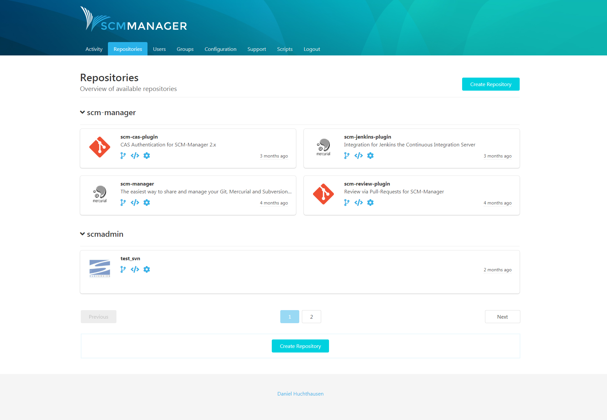

Over the last couple of years it became clear that SCM-Manager 1 does not have the capabilities to fulfill the requirements of a modern SourceCodeManagement Tool. Great feature requests had to be rejected, because they simply could not be implemented with SCM-Manager 1. That is why the development of SCM-Manager 2 started. Now, thanks to the tremendous effort of [Cloudogu](https://cloudogu.com/en/blog/scm-manager-collaboration), it is almost done and ready to use. This is what it looks like.

## Major changes at a glance

The big differences between SCM-Manager 1 and 2 are the technologies: the frontend of SCM-Manager 2 is based on React and Redux. The backend uses HATEOAS to provide a level 3 REST API.

Based on the new architecture and on acquired experiences from SCM-Manager 1, the new version will have numerous new features and some changes that make SCM-Manager 2 more convenient and secure. The changes and new features will be introduced in additional posts here. So stay tuned!

## Missing features

Even though the development of SCM-Manager 2 is almost complete, there are still some features missing. That is for example the plugin center and a migration path from SCM-Manager 1 to 2.

If you can’t wait for the official release, you can get the <a href="https://oss.cloudogu.com/jenkins/job/scm-manager-github/job/scm-manager/" target="_blank" rel="noopener noreferrer">latest build of SCM-Manager 2</a> or the <a href="https://hub.docker.com/r/cloudogu/scm-manager/tags" target="_blank" rel="noopener noreferrer">latest Docker image</a>.

From now on, we will share details about the new features of SCM-Manager 2 here.

