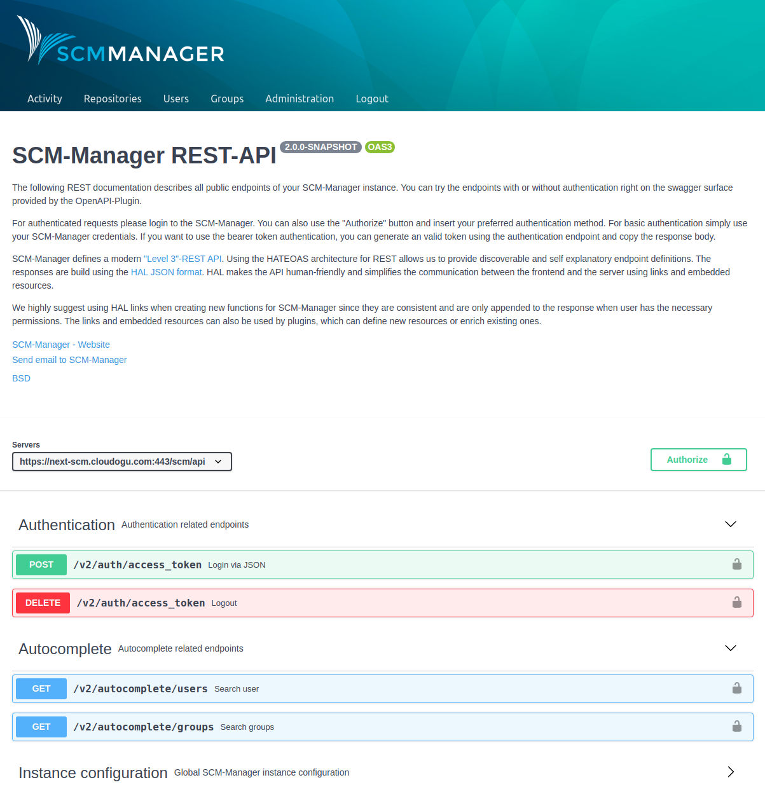
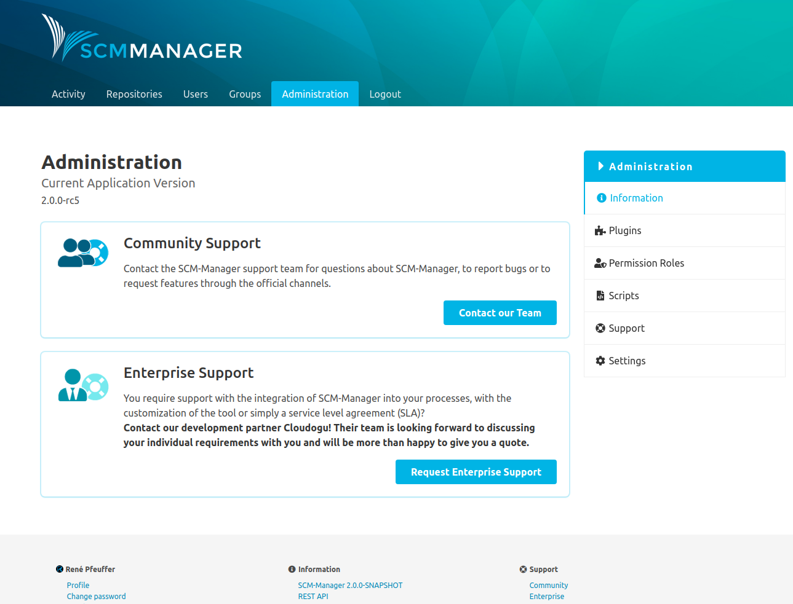
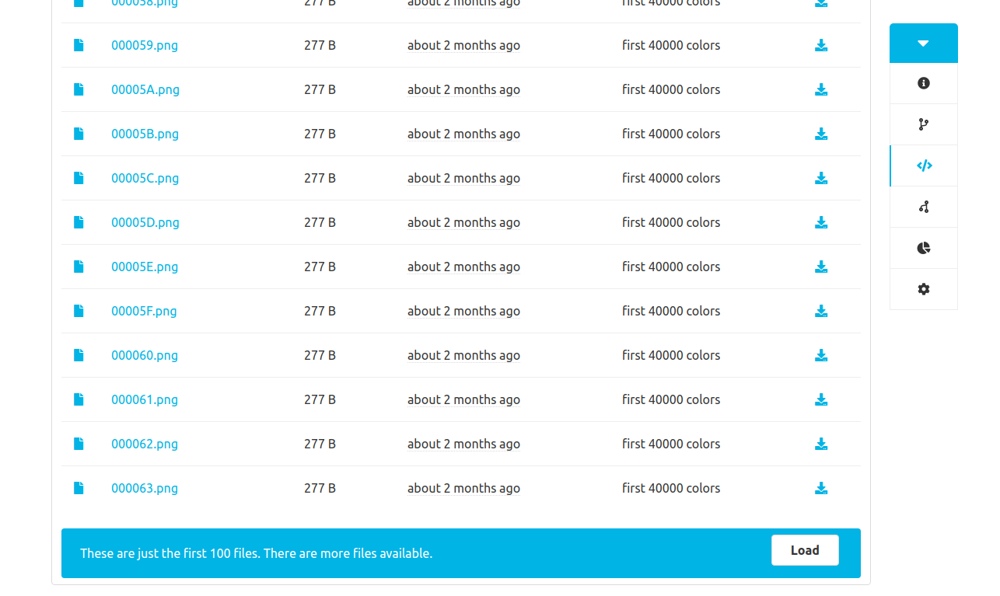

Release 2 of SCM-Manager brings a lot of changes, some small, some big. Besides the most obvious change, the completely new user interface, there is the new  <a href="https://martinfowler.com/articles/richardsonMaturityModel.html" target="_blank" rel="noopener noreferrer">level 3 REST API</a>, which took us a considerable amount of effort to create.

The new REST API allows scripts and other applications to “navigate” from the top level REST resource (`/scm/api/v2`) to every resource available and to change them: repositories, sources, configurations, and items from plugins like pull requests. Using the editor plugin it is possible, to add or change files in repositories without checking them out, first.

## OpenAPI plugin

Of course, all these possibilities can only be fully utilized when there is comprehensive documentation. The problem is, the API may change depending on your version of SCM-Manager and the plugins you have installed. So what we give you today is not a wiki page or a pdf, but another plugin: the OpenAPI plugin. This plugin adds a new link to the footer of SCM-Manager: “Rest API”.

Click the link and you will get an OpenAPI (also known as Swagger) online documentation, that tells you exactly what is possible with your current system. It will show you all possible requests and you can even try them out.

## Collapsable navigation menus

Another change that you might stumble upon, is a little triangle in the secondary navigation menus. Press this, and the menu will collapse. This is useful in particular for source and diff views.

Normal menu:  
  
Collapsed menu:  

## Limitation on source view

Another little change is something you may never notice, but nonetheless it is good to have it in place: If you ever have a repository with a large number of files, SCM-Manager will not break down whenever you try to take a look at the sources. Instead, it will only read up to 100 files per request. You can choose to read more, though.

## Get the new version

You can download the RC-5 here

- [.tar.gz](https://maven.scm-manager.org/nexus/service/local/repositories/releases/content/sonia/scm/scm-server/2.0.0-rc5/scm-server-2.0.0-rc5-app.tar.gz) (sha1: 3b2dff3fda0c46362c518be37edd4e77bccc88bb)
- [.zip](https://maven.scm-manager.org/nexus/service/local/repositories/releases/content/sonia/scm/scm-server/2.0.0-rc5/scm-server-2.0.0-rc5-app.zip) (sha1: 1aa865ea400e8aaf08c175dbaf316c48bb066b41)

or use it via Docker

`docker run -p 8080:8080 -v scm-home:/var/lib/scm --name scm scmmanager/scm-manager:2.0.0-rc5`

