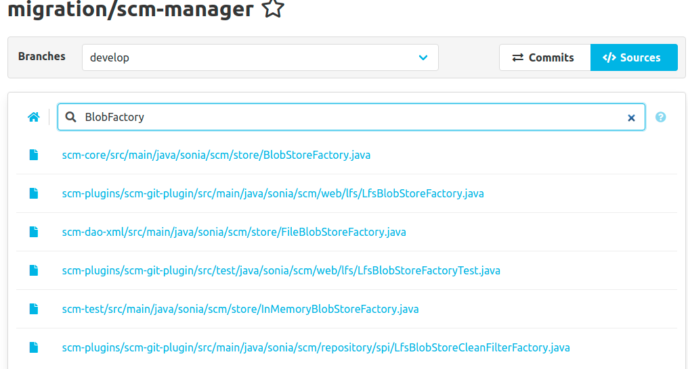

Hey SCM-Manager community,

with the new release it is now possible to search for filenames inside your SCM-Manager repositories, and with metrics
you can gain insights into your SCM-Manager server. 
Checkout the newest release to find about everything that changed.

## Search for files inside repositories

Finally, it is possible to search for files and directories within repositories.
To search for a file, you can click the search icon next to the file path in the source view of the repository.
On the file search page, you can enter parts of the name or the directory you are looking for.
The search is based on the file path only and hits in the file name are ranked higher than hits in the path.

Tell us how you feel about the search function!

## Partial diff
Another issue that noticeably affected performance was loading changesets with a lot of added/changed/deleted files.

We solved this matter by loading the changes in chunks.
You will see 25 changed files directly and can load more by clicking on the button at the bottom.

## Metrics
This new feature set should be especially interesting for administrators running SCM-Manager. 
We created a generic API which collects and provides metrics. 
The first set of metrics contains jvm metrics like memory, threads and garbage collection.

You can get the metrics as [JSON](https://scm-manager.org/plugins/scm-metrics-json-plugin/) or for [Prometheus](https://scm-manager.org/plugins/scm-metrics-prometheus-plugin/) using the related plugin.

## Closing Words

Are you still missing an important feature? How can SCM-Manager help you to improve your work processes? We would love to hear you most needed features!

Have some questions or suggestions for SCM-Manager? Connect directly to the DEV-Team on [GitHub](https://github.com/scm-manager/scm-manager/) or [our Support channels](https://www.scm-manager.org/support/).
