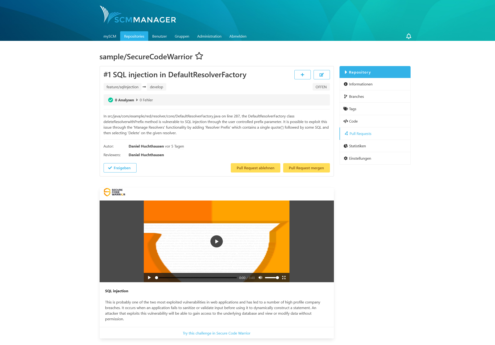
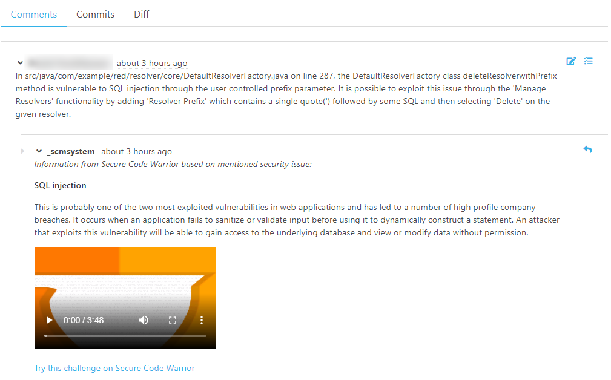

Hey SCM-Manager community,

we are proud to inform you about our newest (and first) official partnership with [Secure Code Warrior](https://www.securecodewarrior.com/).
As part of our cooperation, we created the `SCM-SCW-Plugin` which integrates the Secure Code Warrior learning material into SCM-Manager.
Besides GitHub, SCM-Manager is the second exclusive integration with Secure Code Warrior support.

## Who is Secure Code Warrior?
[Secure Code Warrior](https://www.securecodewarrior.com/) offers a platform that provides developers, 
as well as others interested in security, with knowledge about security vulnerabilities. 
We think, that their approach of using gamification and micro-learning to sensitize developers to the major topic of software security works very well in the short and long term.

## What is the SCM-SCW-Plugin?
The `SCM-SCW plugin` brings parts of the `Secure Code Warrior` knowledge into your SCM manager. 
We focused mainly on two scenarios for the first implementation, 
both of which depend on the pull requests you may know from the `SCM-Review-Plugin`.

### Scenario 1: Pull Request Description

A developer from our team has found a critical `SQLI` (`SQL Injection`) security bug in our code.
He fixes the vulnerability on a new bugfix branch and creates a pull request in our SCM-Manager. 

`Issue:` 
Unfortunately, no other developer has knowledge about `SQLI` and therefore cannot verify his changes.

`Solution:`
As soon as the pull request contains keywords related to its security-related fix, such as `SQLI`, 
in the title or description, `Secure Code Warrior` learning content will be shown directly in the pull request.
Now the reviewers can learn about SQL injection before reviewing the changes.

### Scenario 2: Pull Request Comments
A developer from our team creates a new feature regarding sql statements. 
He pushes his feature on a new feature branch and creates a pull request in SCM-Manager.

Afterwards a reviewer checks the new features and finds some issues in the code. 
There is an attack vector which can be exploited with SQL injection using user-controlled inputs.
The reviewer creates comments describing his findings in the pull request.

`Issue:`
Now the developer needs to understand how this vulnerability works and how to fix it.

`Solution:`
As soon as the reviewer post comments containing special keywords like `sqli` or `SQL injection` in the pull request,
the Secure Code Warrior plugin adds matching content from `Secure Code Warrior` as a reply. 

## Where can I download this plugin?

This plugin is completely free and doesn't require an account for `Secure Code Warrior`. 
It is not available in the official SCM-Manager plugin center but you can download and install it manually.

Take a look at the [documentation](https://forum.cloudogu.com/topic/101) to learn more about how it works and how to install it.
Register and download the `SCM-SCW plugin` from [myCloudogu](https://files.cloudogu.com/file/scm-manager/plugins/secure-code-warrior/latest). 
