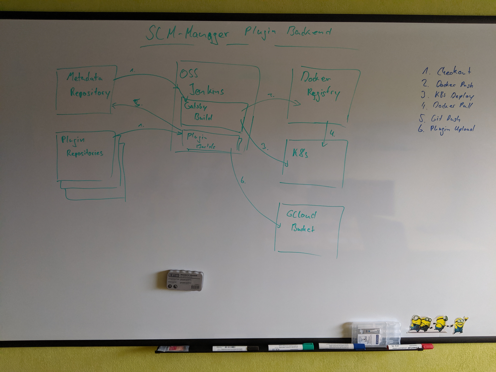

If you want to share your plugin with SCM-Manager users, you can publish it to the SCM-Manager Plugin Center by following the steps below.

* Create a Mercurial or Git repository for your plugin
* Develop your plugin as described in [Create a plugin](/docs/create)
* Fork the [Plugin Center Repository](https://bitbucket.org/scm-manager/plugin-center)
* Create a folder with the name of your plugin under the `src/plugins` directory
* Put a `index.md` which starts with frontmatter metadata, which describes your plugin e.g.:

```yaml
---
name: scm-cas-plugin
displayName: CAS
description: CAS Authentication plugin for version 2.x of SCM-Manager
category: authentication
author: Cloudogu GmbH
---
```

* Document your plugin with [markdown](https://github.com/adam-p/markdown-here/wiki/Markdown-Cheatsheet) below the frontmatter header
* Commit your work and open a pull request. Put the url to your plugin repository into the description of the pull request.

After you have opened the pull request. 
We will do a few steps to integrate your plugin into the plugin center:

* We will create a fork of your plugin under the [SCM-Manager Team](https://bitbucket.org/scm-manager/) and give your account write permissions
* After that we will create a Jenkins job for your plugin on [oss.cloudogu.com](https://oss.cloudogu.com/jenkins/job/scm-manager/job/scm-manager-bitbucket/)
* At the end we will accept your pull request

From now on you can work with the repository in the [SCM-Manager Team](https://bitbucket.org/scm-manager/).
Every time you release your plugin (push a tag to the repository) the Jenkins job will build your plugin and release it to the plugin center.


# Architecture

The following picture shows the architecture of the involved systems.


