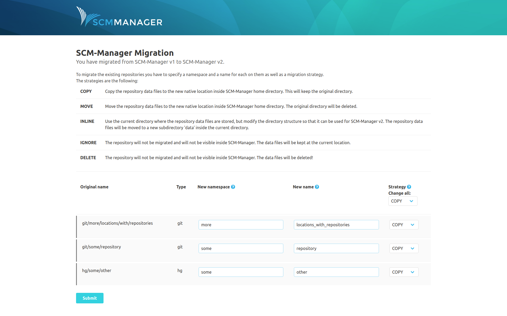

We are more than happy to announce that the first release candidate of SCM-Manager 2 is ready!

Since the last news about SCM-Manager 2 we have worked on the missing key features like the plugin center or anonymous access to repositories. Now it is done and we are offering you the chance to try RC-1 yourself.

## How to get RC-1

Currently there are two ways to run SCM-Manager 2:

### Docker

To start SCM-Manager with a persistent volume on port 8080 run the following command:

`docker run -p 8080:8080 -v scm-home:/var/lib/scm --name scm scmmanager/scm-manager:2.0.0-rc1`

### Standalone Server

The standalone server requires an installed jre version 8. You can download the binaries here:

- [.tar.gz](https://maven.scm-manager.org/nexus/content/repositories/releases/sonia/scm/scm-server/2.0.0-rc1/scm-server-2.0.0-rc1-app.tar.gz) (sha1: 954e3f5c7a5e743d3db530f9865fece1660c9680)
- [.zip](https://maven.scm-manager.org/nexus/content/repositories/releases/sonia/scm/scm-server/2.0.0-rc1/scm-server-2.0.0-rc1-app.zip) (sha1: f72f473032e6043d767a89ebc621c222f36dfa9e)

Extract the downloaded archive and start `scm-server/bin/scm-server` or `scm-server\bin\scm-server.bat`. Your scm-manager should now be running on port 8080.

## Migration from SCM-Manager 1

First of all: Before you try migrating to SCM-Manager 2 we advice you to backup all your repositories!

If you already want to migrate from SCM-Manager 1 to the new version, you can do that pretty easily. All you have to do is to upgrade your SCM-Manager to at least version 1.60. Once you have done that, you have to start SCM-Manager 2 with the same home folder. When you access SCM-Manager 2, there will be a wizard that will help you to migrate your repositories to the new structure of SCM-Manager. After that, it will perform the migration fully automatically.

For more information about the migration have a look [here](https://bitbucket.org/sdorra/scm-manager/wiki/v2/Migration-Wizard).

## Why you should get it

Even though SCM-Manager 1 already was pretty good, we are convinced that SCM-Manager 2 is way better! Now that all key features are implemented it is worth looking into the new version. If you want to fresh up your mind about the changes and new features, you can look here:

- [SCM-Manager news](https://www.scm-manager.org/scm-manager-2/scm-manager-2-development/)
- [Namespaces, readme files and review plugin](https://cloudogu.com/en/blog/scm-manager-2-news-update-3)
- [Changesets and repository configuration](https://cloudogu.com/en/blog/scm-manager-2-news-update-2)
- [General information](https://cloudogu.com/en/blog/scm-manager-2-news-update)

## Give feedback

If you run into problems or you want to give us feedback for the new version, feel free to contact us using the [mailing list](https://groups.google.com/forum/#!forum/scmmanager) ([scmmanager@googlegroups.com](mailto:scmmanager@googlegroups.com)).

